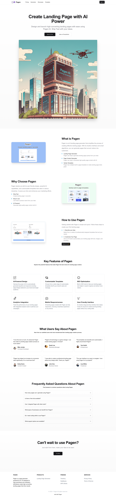
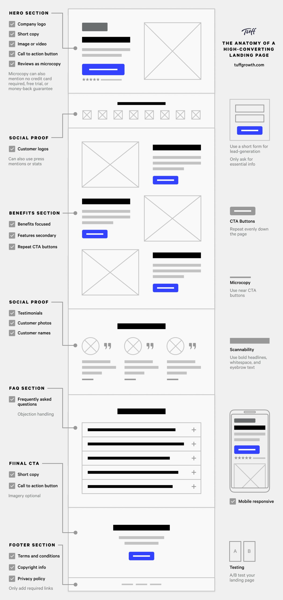

# Pagen AI Landing Page Template

This is a landing page template created by [Pagen AI](https://pagen.so). It is built with Next.js and Shadcn UI.



## Local Development

1. Clone the repository

```shell
git clone https://github.com/all-in-aigc/pagen-ai-landing-page-template landing-page

cd landing-page
```

2. Install dependencies

```shell
pnpm install
```

3. Preview the landing page

```shell
pnpm dev
```

4. View the landing page at

`http://localhost:3000`

## Customization

You can customize the landing page content by editing the `data/demo.ts` file.

You can customize the landing page style by editing the `templates/shadcn/` folder.

You can create a new page with a new `page.tsx` in the `app` folder:

```ts
import Landing from "@/templates/shadcn/pages/landing";
import { page } from "@/data/demo";

export default async function () {
  return <Landing page={page} />;
}
```

## Create Template

You can create a new template by creating a new folder in the `templates` folder.

organize the template files with the following format:

```
new-template
├── assets
│   ├── css
│   │   └── style.css
│   └── imgs
│       └── logo.png
├── components
│   ├── cta
│   │   └── index.tsx
│   ├── faq
│   │   └── index.tsx
│   ├── feature
│   │   └── index.tsx
│   ├── footer
│   │   └── index.tsx
│   ├── header
│   │   └── index.tsx
│   ├── hero
│   │   └── index.tsx
│   ├── pricing
│   │   └── index.tsx
│   ├── section
│   │   └── index.tsx
│   ├── testimonial
│   │   └── index.tsx
│   └── usercase
│       └── index.tsx
└── pages
    └── landing.tsx
```

follow this image 👇 to organize the content parts in `pages/landing.tsx`



## Submit Template

After you created your template, you can submit it to Pagen Templates Center with an issue:

[https://github.com/all-in-aigc/pagen-ai-landing-page-template/issues](https://github.com/all-in-aigc/pagen-ai-landing-page-template/issues)

## Credits To

- [Pagen AI](https://pagen.so)
- [Next.js](https://nextjs.org)
- [Shadcn UI](https://ui.shadcn.com)

if you use this Landing Page Template, please give a credit to [Pagen AI](https://pagen.so)

> Create landing page in seconds, try it out 👉 [Pagen AI Landing Page Generator](https://pagen.so/landing-page-generator)
